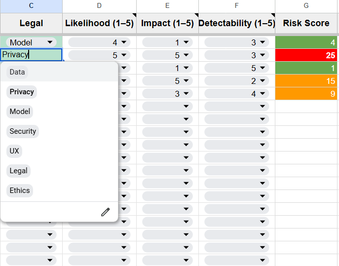
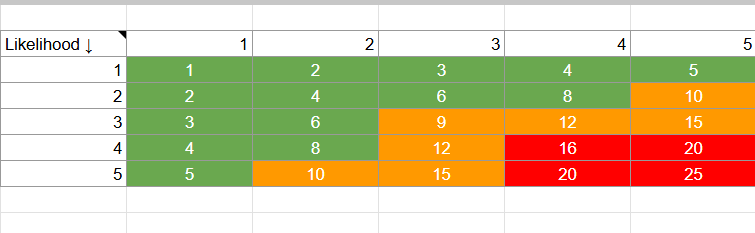
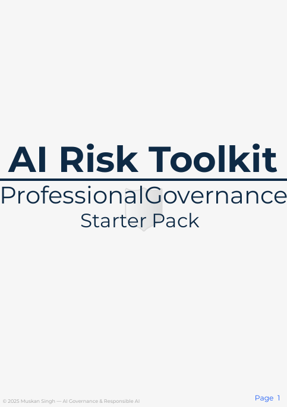

<h1 align="center">AI Risk Toolkit — Professional Governance Starter Pack</h1>
<p align="center">
  
</p>
<p align="center">
  
  
</p>

[](https://singhmuskan552-ux.github.io/AI-Governance-Starter-Pack/)

> A practical, audit-ready AI governance starter pack designed for early-stage teams, students, and Responsible AI learners.  
> Includes a Risk Register (Excel), governance documentation, helper sheets, and templates.  
> Helps teams build structure, transparency, and accountability into AI systems from Day 1.

# AI Risk Toolkit — Professional Governance Starter Pack (v1.0)

---

## ⭐ Overview

The AI Risk Toolkit is built for:
- Early-stage AI teams  
- Founders adding AI features to products  
- Compliance, risk & assurance practitioners learning AI governance  
- Students and beginners exploring Responsible AI

This pack gives practical, plug-and-play governance tools without the heavy complexity of enterprise frameworks.

---

## 📦 What’s inside (v1.0)

- **AI Risk Register (Excel)**  
  Automated scoring (Likelihood × Impact × Detectability), heatmap visualisation, pre-built dropdowns, and analytics.

- **Governance Guide (PDF)**  
  Clear workflows, roles & responsibilities, checklists, and templates to implement governance quickly.

- **Helper Sheet**  
  Logic reference, automation formulas, and versioning notes for maintainers.

- **License, Support & Version Notes**  
  Guidance for permitted use, update path, and how to request help.

---

## 📸 Toolkit Previews

Below are a few screenshots showcasing the AI Risk Toolkit in action:

### 🔹 Risk Register Preview
<p align="center">
  
</p>

### 🔹 Heatmap (Automated Scoring)
<p align="center">
  
</p>

### 🔹 Governance Guide Preview
<p align="center">
  
</p>

### 🔹 Summary Table (AI Risk Assessment)
<p align="center">
  
</p>

---

## 📁 Repository structure

```
AI-Governance-Starter-Pack/
├── README.md                # Main documentation (this file)
├── LICENSE                  # License file (MIT)
├── assets/                  # Visuals, banners, images
│   └── cover-image.png      # Hero image used in README
├── toolkit/                 # Core downloadable toolkit files
│   ├── ai-risk-register.xlsx   # Primary Excel risk register
│   ├── governance-guide.pdf    # Governance documentation
│   └── helper-sheet.xlsx       # Helper logic & automation formulas
├── samples/                 # (Optional) Example outputs, demos
└── docs/                    # (Optional) Extended docs, changelogs
```

---

## 🎯 Purpose Behind This Toolkit

As someone early in the Responsible AI space, I often found myself thinking:

> “I wish there was a simple, structured toolkit I could plug in while learning.”

I built this resource because I wanted governance tools that were **practical**, **accessible**, and **actionable** — especially for individuals, students, and small teams who don’t have enterprise-level frameworks.

This starter pack helps teams:

- Map and evaluate AI risks  
- Build lightweight governance foundations  
- Improve transparency and assurance  
- Prepare for upcoming AI regulations  

---

## 🚀 Roadmap (Planned Updates)

- ✔ Heatmap automation upgrade  
- ✔ Cleaner dropdown categories  
- ⬜ Add Responsible AI checklist  
- ⬜ Add model card template  
- ⬜ Add “AI use-case intake” workflow  
- ⬜ Add sample datasets and examples  

---

## 🤝 How to Contribute

Contributions are welcome!  
If you'd like to improve the toolkit, fix documentation, or suggest new templates:

1. Open an issue describing your idea.
2. Fork the repository and create a branch:
3. Make changes and open a pull request.
4. Follow the guidelines in **CONTRIBUTING.md**.
   
Even small improvements (typos, formatting, clarity) are appreciated.

---

## 📄 License

This project is released under the **MIT License**, which permits:

- Free use  
- Modification  
- Redistribution  

As long as the original license notice is included.  
This makes the toolkit flexible for **students, educators, startups, and researchers**.

---

## 💬 Support & Feedback

If you find this toolkit useful, feel free to:

- ⭐ Star this repository  
- 📨 Open an issue for suggestions or improvements  
- 🔗 Connect on LinkedIn  

Your feedback directly shapes and improves future versions.

---

<p align="center">
  Maintained by <strong>Muskan Singh</strong> • MIT License • v1.0.0
</p>


---

