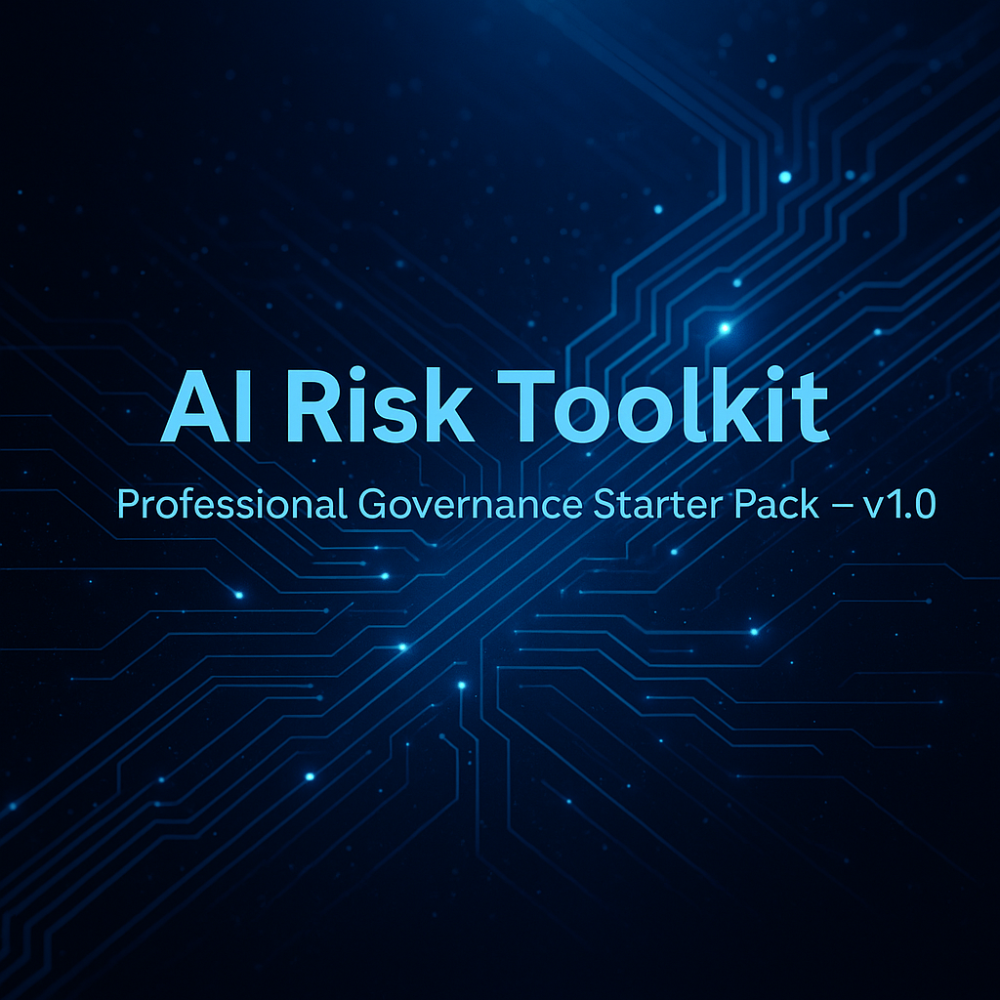

---
  # AI Risk Toolkit — Professional Governance Starter Pack
---

  

  
  

> A practical, audit-ready AI governance starter pack designed for early-stage teams, students, and Responsible AI learners.  
> Includes a Risk Register (Excel), governance documentation, helper sheets, and templates.  
> Helps teams build structure, transparency, and accountability into AI systems from Day 1.

# AI Risk Toolkit — Professional Governance Starter Pack (v1.0)

---

## ⭐ Overview

The AI Risk Toolkit is built for:

- Early-stage AI teams  
- Founders adding AI features to products  
- Compliance, risk & assurance practitioners learning AI governance  
- Students and beginners exploring Responsible AI

This pack gives practical, plug-and-play governance tools without enterprise complexity.

---

## 📦 What’s inside (v1.0)

- **AI Risk Register (Excel)** — Automated scoring (Likelihood × Impact), heatmap visualization, pre-built dropdowns, and analytics.  
- **Governance Guide (PDF)** — Roles, responsibilities, and lightweight workflows for teams.  
- **Helper Sheet (XLSX)** — Formulas, lookup tables, and user instructions.  
- **Templates** — Policy & audit templates, stakeholder slide deck, and prompt library.  
- **README & assets** — Repository documentation, cover banner, and release notes (v1.0).

---

## 📥 Download v1.0

 Get the complete toolkit (Excel files, templates, and documentation) from the official GitHub Release:

 👉 [Download v1.0.0](url)

 All files are included in a single release bundle for easy setup.

---

## 📸 Screenshots

 Preview the toolkit through the included visuals:

 Hero banner (cover image)

 Risk Register preview (Excel scoring layout)

 All images are available in the /assets folder inside the repository.

## 🧭 Roadmap (next)

- Responsible AI checklist  
- Model card template  
- Sample AI use-case intake form  
- Smarter scoring automation & scripts  
- Polished landing page and Gumroad integration

---

## 📄 License

Released under **MIT License** — free to use, modify, and distribute.

---

## 👋 Contact

If you have feedback, file an issue or open a discussion in the repo.  
Maintainer: **Muskan Singh**
